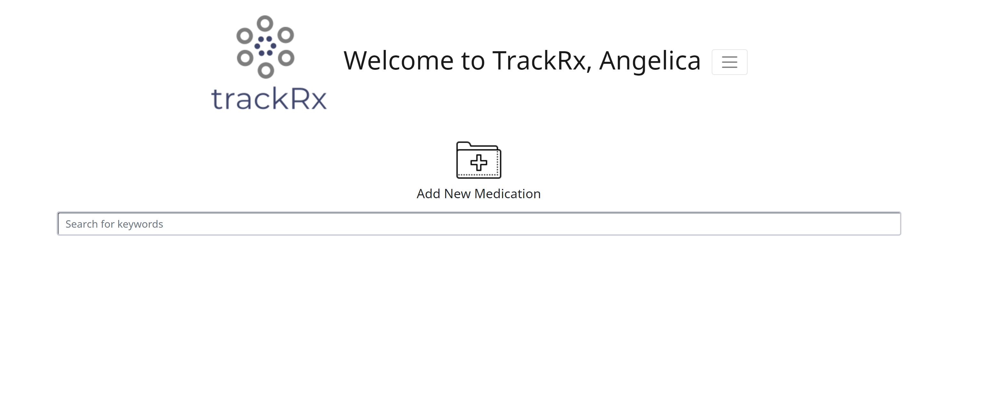
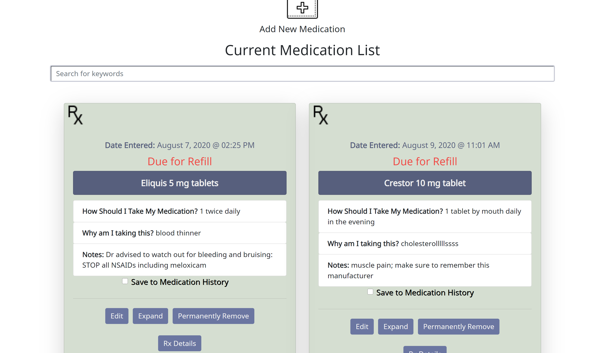
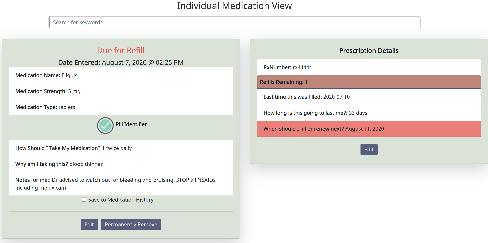
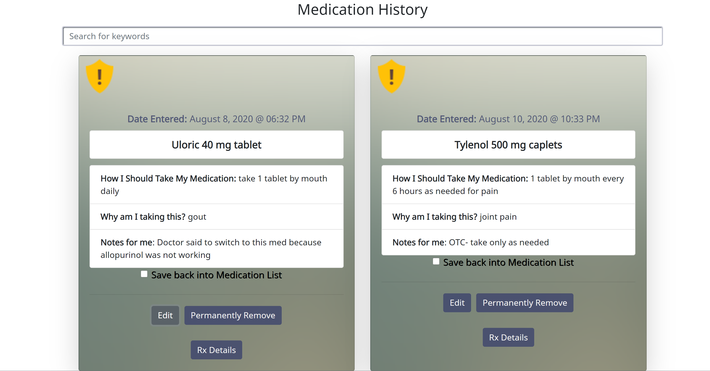
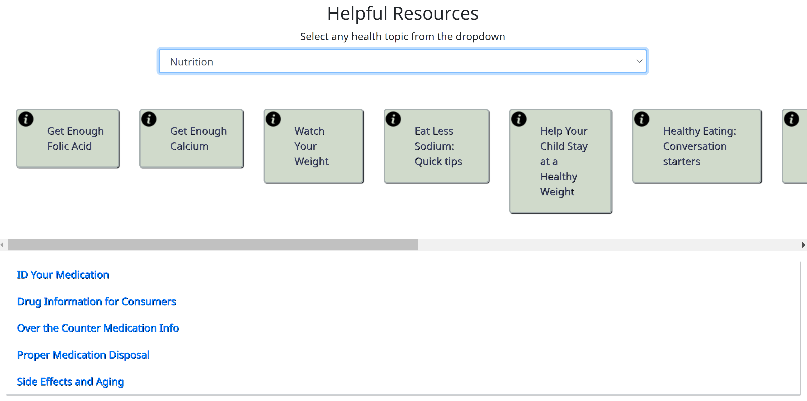

# trackRx

Inspired by my experience as a pharmacist, and understanding that patients have a very difficult time managing multiple medications for multiple disease states, as well as understanding the reasons behind taking certain medications, and making sense of large amounts of information coming from their medical providers and pharmacists, this application sought to help alleviate some of this confusion.

## Application Overview

- What are the features of the application?

  - Users can document the drug name, dosage, dosage form, their patient specific directions, indication, and patient specific notes all in one place (ie doctor notes/comments or any questions they may have for their provider and/or pharmacist). CRUD functionality will be present for each inidivudal medication entry.

  - Users are also able to input prescription numbers and refills (if applicable) as well as last fill date and days supply, which will then automatically calculate their next refill date.

  - A running, real-time countdown (by days) until next refill date for each individual medication will also be displayed on each individual medication entry to help prevent users from running out of their medication.

  - Allow users to use a search tool to query for specific keywords regarding their medications (ie 10 mg, drug name, indication, etc)

  - Users are able to upload any image (ie bottle, pill picture, reminders) and attach it to their medication entry for future reference (made possible through Cloudinary)

  - Provide resources for health and medication information in one location. By utilizing [health.gov external API](https://health.gov/our-work/health-literacy/consumer-health-content/free-web-content/apis-developers/how-use-api), users can select a health topic from a dropdown menu and click any of the links pertaining to the topic they wish to learn more about

## Installation

**Make sure you have Node.js and npm installed**

1. `cd` into your local directory you wish to clone this repository
2. `git clone` repository URL
3. `npm install`
4. `cd` into `api` directory
5. `touch database.json`
6. serve JSON file utilizing `json-server -p 5002 -w database.json` in terminal
   > Note: Your database.json file is already in the .gitignore file for this project, so it will never be added to the repo or pushed up to Github.
7. `npm start`
8. At this point, your browser should automatically launch the webpage
9. Register an account and it will send you to the homepage

## Usage

### JSON

Your database should be populated with the information you enter inside the application (ie drug information and user information).

If you have any questions regarding what the database structure should look like, please see "example.json" file in the `api` directory. Note that every property name needs to be identical to those listed in this example JSON file. Id's should be automatically and uniquely generated for each entry. By default, the ["taking"] property will have a value of `true` upon the user adding a medication (ie the user is creating a new medication entry to input into their `Current Medication List`)

> **PLEASE NOTE**: NONE of the information used in the following images are that of real people or patients

## Application Walkthrough

The following link is a walkthrough regarding most of the functionality of this application:
[trackRx](https://www.loom.com/share/d6fdb8f7cd5443b389e95af70ca55398)

> For more detailed information regarding usage of the application, please refer to the following descriptions:

### Homepage

1. User can click folder icon to add new medication entry
2. Upon clicking, a modal should appear
3. User can choose to add whatever image they would like or decide to add it later (able to add and edit image in `Current Medication List` and `Individual Medication View`)
4. All required fields are marked with '\*'
5. User should click 'Refill Details' button, which will bring up another modal window to fill out all required fields
6. Using the search bar, user can search for any keywords regarding their medications and with every character typed into input field, the search function will narrow down the results (ie by dosage, name, indication, notes)
   - if user searches for drug that is in the `Medication History List` (ie not currently taking this medication), the corresponding medication history card will display (vice versa if the drug they are searching for is in their `Current Medication List`)
   - user will have full CRUD functionality available on the individual medication entry cards from the results of the search bar

### Current Medication List Page

1. User can click folder icon to add new medication entry (please follow same instructions from homepage)
2. User should see a list of their current medications including the following functionality:
   - date they entered the medication entry
   - `Save to Medication History` checkbox: once clicked will allow user to send their medication card to the `Medication History List` (please see below for more details), which signifies they should stop taking the medication, but does not completely remove the entry from the database (changes property of ["taking"] to `false`)
   - a real-time countdown of how many days remain until they are due for a refill
     - if the time left until refill is less than or equal to 7 days, the number displayed will be highlighted to remind user
     - if they are within 1 day or the due date for refill, 'Due for Refill' will display on designated medication card
   - `Edit` button: brings up edit form similar to 'add medication' form where they can edit any field (changes should appear after user clicks `Save Edited Medication`)
     - Image can also be edited, however the image will only appear in `Individual Medication View`
   - `Expand` button: brings user to individual medication details view (please see below)
   - `Permanently Remove` button: once clicked will completely delete medication entry from database
   - `Rx Details` button: once clicked will show a pop-up of their prescription number, refills remaining, last fill date, days supply, and next refill/renewal date
     - if one refill remains, refills will be highlighted yellow; if no refills remain, it will be highlighted red
     - if medication is due or past due for refill, it will be highlighted red unless user edits the prescription details information
3. Search functionality is available on this page as well, with CRUD functionality available for each medication entry result

### Individual Medication View Page

Once user clicks `Expand` from `Current Medication List` page, user will be brought to this view, which includes:

- all the information present in the `Current Medication List`, however prescription details will be clearly visible to the right of the main medication card
- user will have the option to click `Pill Identifier` button, which will take them to an external link where they can verify the identity of the medication (ie if they get a different manufacturer or become unsure of what they are taking)
- user will be able to edit any fields on medication card, including editing the image, if needed.
- user will be able to click `Save to Medication History` checkbox and send medication card to the `Medication History List`

### Medication History List Page

Once user clicks `Save to Medication History` checkbox they will be brought to this list, which will list all their past medications.

This list becomes practical in certain scenarios when:

1. user should not be taking a specific medication, but user would like a history of their past medications and/or
2. user is to pause a medication, but may resume said medication at a later date

- User is able to click `Save back to Medication List` checkbox, which will send the medication card back to their `Current Medication List`
- User can edit any fields upon clicking `Edit` button, except for the image
- User can permanently remove the medication entry by clicking `Permanently Remove`
- User can see prescription details by clicking `Rx Details` button, however nothing will be highlighted according to refills remaining or next refill/renewal date. There will also not be any real-time countdown to their next refill/renewal date

3. Search functionality is available on this page as well, with CRUD functionality available for each medication entry result

### Resources Page

With the unlimited online health information present, it is at times difficult to distinguish between reliable and anectodal information. The `Resources` page helps to collect some commonly asked questions regarding pharmacy topics as well as utilize the health.gov external API, which allows users to select various health topics pertaining to their disease state and learn more about them.

- Users are able to click the dropdown menu and select any health categories; once clicked, links will appear
- User can click on these links and be brought to an external website regarding the specific health topic they chose
- Below the dropdown menu should be a list of helpful pharmacy resources, which are clickable and will bring user to an external website with trustworthy information

## Technologies Used

- Visual Studio Code
- React library
- Reactstrap
- Cloudinary
- [health.gov external API](https://health.gov/our-work/health-literacy/consumer-health-content/free-web-content/apis-developers/how-use-api)
- dbDiagram
- Sketchboard

## Acknowledgments

Thank you to the entire Cohort 41 team. You guys are amazing and such a talented group of individuals. Thank you for all your help and support through our capstone projects. You are all very much appreciated. Special thank you to Brenda Long, Sage Klein, and Rose Wisotzky for all their help, time, encouragement, and humor throughout this whole process.

## Future Improvements Roadmap

I would like to add the ability for the user to register and create a profile, but also allow one user to create multiple profiles (ie for their spouse or children) so that families can keep all their medication tracking in one place without having to register different accounts

I would like to improve on the application by adding a calendar feature where users can mark days they missed taking a particular medication; in addition, I would like to possibly add a logging method for blood pressure readings or glucose readings and somehow integrate that into their calendar

In addition, I would like to add a reminder (ie daily alarm) they can set to remind them to take their medication at a certain time

## Support and Contributions

If any users have any additional questions, concerns, or feedback for future improvements, please do not hesitate to submit an issue ticket. I am open to any and all suggestions and ideas.

## Planning Links

1. [ERD](https://dbdiagram.io/d/5f146e1274ca2227330d8a66)

2. [Wireframe](https://sketchboard.me/XCfnZXA8pWcG#/)
